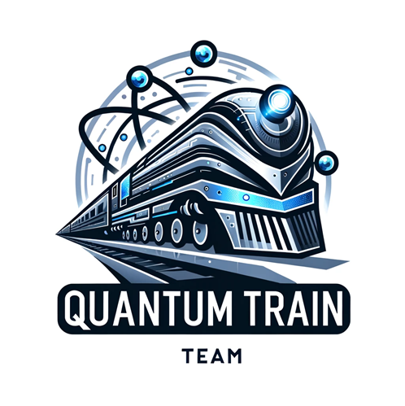
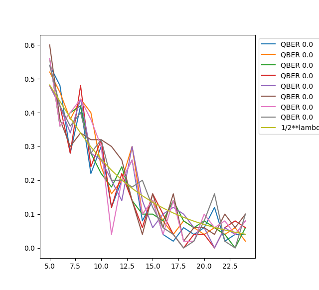
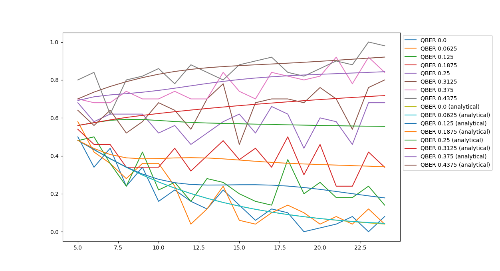

# Quantum Train - team from Poznań 

## Members
Mikołaj Czechlewski \
Mateusz Dyrda \
Jakub Małdrzykowski \
Leonard Sikorski \
Marek Winczewski

# Challenge
Secure Quantum Digital Payment (see the paper [Demonstration of quantum-digital payments](https://arxiv.org/abs/2305.14504))

# Problems
* Since our protocol is multinode, the code from `blueprint-integration-beta` branch of `squidasm` repository is required. It took us some time to realize that.
* Since Python has GIL, we had to use `multiprocessing` package to speedup computations ...
* ... but still it was very slow :)

# Results
## What has been implemented?
- Simulation of the original protocol with three parties - Trusted Third Party (TTP), Client and Merchant.
- Simulation of malicious merchant which tries to forge malicious $M'$.
- Script for estimating success probability of malicious merchants behaviour for different simulation parameters.

## Simulation data
We have derived the following formula for probability of malicious merchant success. 
$$p(\lambda, Q) = \sum_{k=1}^{\lambda} \binom{\lambda}{k} \left(\frac{1}{2}\right)^{\lambda}\sum_{j=0}^{\lfloor kQ\rfloor} \binom{k}{j} \left(\frac{1}{4}\right)^{j} \left(\frac{3}{4}\right)^{k-j}$$
It is parametrized by the number $\lambda$ of quantum states sended from TTP to Client and "QBER acceptable by TTP" which is maximal QBER $Q$ for wich TTP accepts the transaction.\
This formula fits experimental data from simulation:\

Figure 1: Multiple simulation runs with $Q=0$ and $\lambda =5\ldots 23$. The green smoth line is our analytical result. The probability was obtained by averaging over 100 runs.

Figure 2: Multiple simulation runs with $Q=0\ldots 0.4375$ and $\lambda =5\ldots 23$. Smooth lines are analytical solutions. The probability was obtained by averaging over 100 runs.

# Next steps
* The concept of "QBER acceptable by TTP", which we were choosing arbitrarly for each simulation run is a bit strange and artificial. We have to translate it to the language of fidelity of quantum channel, because imperfections in quantum communication is the factor that forces TTP to accept some number of errors.
* Since the code was created in 18 hours on the high dose of caffeine and during the extensive brainstorms, it has to be highly refactored.
